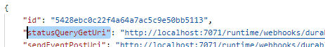

# Overview
A durable function interacting with a SQL Server DB with using Entity Framework.
Azure Functions doesn't allow .NET 5 yet, so attempted to use EF5 targeting .NET Core 3.1. This caused an issue with reference requriements between EF5 and Azure Functions around logging extensions. So targeting .NET Core 3.1 with EF Core 3.1.

# Setup
Add a local.settings.json with the following:
```
{
  "IsEncrypted": false,
  "Values": {
    "AzureWebJobsStorage": "<<< connection string to storge account >>>",
    "FUNCTIONS_WORKER_RUNTIME": "dotnet",

    "EmployeesDbConnectionString": "<<< connections string to SQL Server DB >>>"
  }
}
```

Execute the "CreateEmployeesTable.sql" in the targeted DB.

# Run
Start the function code.

Execute a POST to http://localhost:7071/api/AddEmployee_HttpStart to run the function with a body like
```
{
    "EmployeeNumber": "ABC123",
    "EmployeeDisplayName": "David DeLoveh",
    "EmployeeEmails": "|empa1@deloveh.com|david@deloveh.com|"
}
```

In the output execute a GET against the value of the statusQueryGetUri value to see the results


In the "output" element expect to see a new GUID as the first value and a Guid.Empty value in the second.
```
{
    "name": "AddEmployee_Orchestrate",
    "instanceId": "5428ebc0c22f4a64a7ac5c9e50bb5113",
    "runtimeStatus": "Completed",
    "input": {
        "EmployeeID": "5dd2a971-8b4b-49d2-a0a1-5db818d6bec9",
        "EmployeeNumber": "ABC123",
        "EmployeeEmails": "|empa1@deloveh.com|david@deloveh.com|",
        "EmployeeUpn": null,
        "EmployeeDisplayName": "David DeLoveh",
        "DateCreated": "2020-12-02T13:47:24.5343966Z"
    },
    "customStatus": null,
    "output": [
        "5dd2a971-8b4b-49d2-a0a1-5db818d6bec9",
        "00000000-0000-0000-0000-000000000000"
    ],
    "createdTime": "2020-12-02T13:47:24Z",
    "lastUpdatedTime": "2020-12-02T13:47:29Z"
}
```